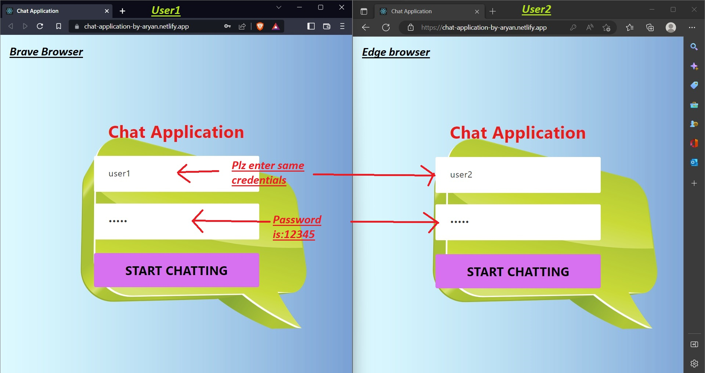
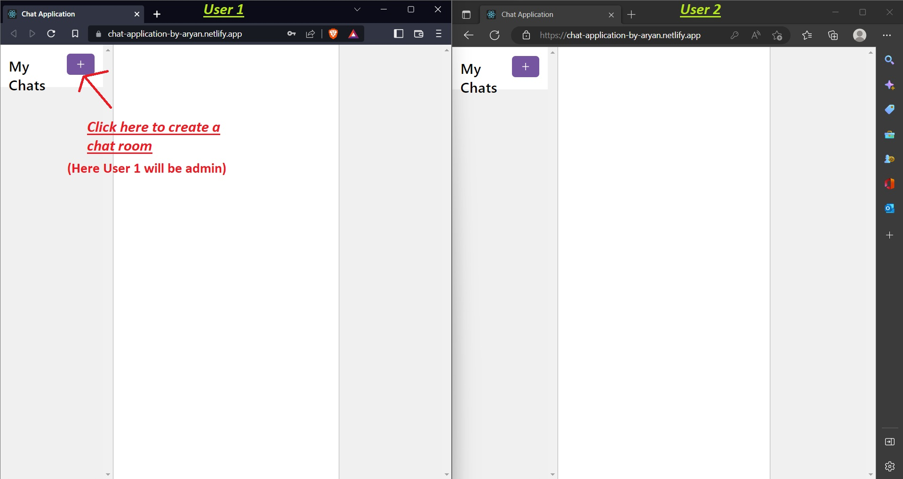
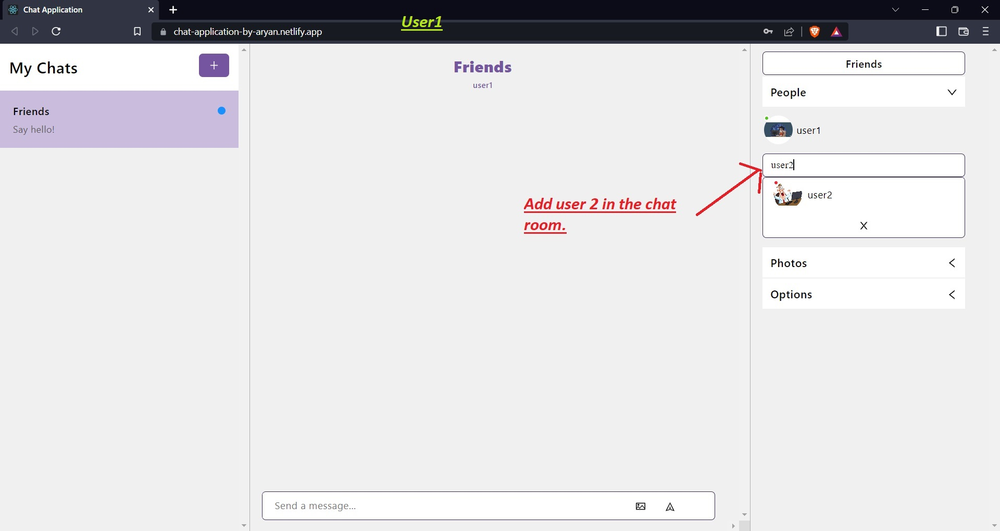

# Chat App by Aryan

A Chat App that uses user credentials to log in and allow user to chat in an excellent environment.

## Frontend:

- React JS
- React Chat Engine(UI Kit)
- CSS

## Backend

 - React Chat Engine(API)

## Demo

https://chat-application-by-aryan.netlify.app

## Note
- Please  note that we will require two different browsers to login as two different users because after login for the first time it will store the user credentials in local storage(hence it will be always logged in with same user) of the browser so in the same browser it will not allow to login as different user. 

## User Credentials 
- For 1st user: Username: user1 , Password:12345
- For 2nd user: Username: user2 , Password:12345

## Guide

## Feedback

If you have any feedback, please mail us at aryanksaw.official@gmail.com

